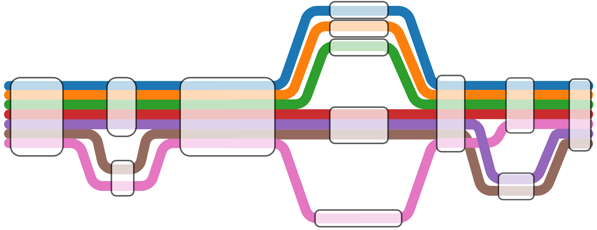

Here are some current areas of interest:  
----------------------------------------------------------

#### Building pangenome graphs

Most current genomic analyses rely on alignment to a single linear reference genome to detect variation or quantify functional enrichment. This removes our ability to identify novel sequences not present within the reference and limits characterization of structural variations in the genome, which can have large functional consequences. Pangenome graphs represent the total genetic diversity of a species or population in a graph-based data structure, with individual haplotypes occuring as "walks" through the graph and variation between individuals displayed using "bubbles" or "snarls". I am working on using long-read sequencing data to build pangenome graphs for marine invertebrate species, which are well-known for harboring high levels of heterozygosity and polymorphism. Downstream analyses will center on how structural variation contributes to population genomic patterns, gene regulation and functional genomics, and broader comparative genomic questions.  

---------------------------------------------------------

#### Genomic selection for oyster aquaculture

The eastern oyster is a ecologically and economically important species, with aquaculture production valued at around $200 million annually. I am interested in developing genomic tools to improve disease resistance and other complex traits in oyster aquaculture. Dermo disease inflicts high mortalities upon farmed oyster populations, and resistance to dermo is a polygenic trait governed by the interacting effects of many genes. The trait's complex genetic architecture and low heritability poses a challenge for traditional phenotype-based selective breeding. Currently, I am working on training machine learning models for genomic predictions of dermo resistance in oysters genotyped with a high-density 66k SNP array. I am also working on evaluating the effectiveness of genomic selection at predicting survival from oysters deployed in the field, where the interacting effects of many stressors may contribute to mortality. Future work in this area will integrate pangenome-derived structural variants into genomic predictions to evaluate the impact of SVs on predictive accuracy.  

----------------------------------------------------------

#### Eco-evolutionary responses to climate change

Local adaptation and phenotypic plasticity represent two complementary mechanisms by which organisms respond to environmental heterogeneity. Understanding when natural selection favors genetically differentiated, locally adapted populations versus genetically homogeneous but phenotypically plastic populations is fundamental to predicting evolutionary responses to climate change. I am interested in testing theoretical predictions that environments which fluctuate in predictable manners favor the evolution of phenotypic plasticity, and also in assessing conditions under which plasticity may facilitate or constrain resilience. Currently, our laboratory uses RNA sequencing to investigate molecular mechanisms of stress response in response to environmental fluctuations as a measure of transcriptional plasticity.  

----------------------------------------------------------

#### Macrosynteny and karyotype evolution

I am interested in the dynamics of genome and chromosome evolution in marine invertebrates. Macrosynteny refers to large-scale chromosome structure conservation over deep evolutionary time, and can provide insight into major genomic rearrangements across different lineages.  Currently, we are studying genome evolution in limpets, using these ancient gastropods to investigate patterns of macrosynteny and chromosome evolution under a broad comparative genomic framework. Limpets display marked reductions in chromosome number and genome size compared to other gastropods and mollusks, many of which show remarkable preservation of the hypothesized ancestral bilaterian karyotype. Thus, limpets provide an interesting system for examining how large-scale genomic changes may influence adaptation over deep time.  

----------------------------------------------------------

#### Machine learning methods development and integration

Artificial intelligence is probably the fastest-moving field of research, with new breakthroughs occuring almost weekly and assumptions in the field being overturned on a regular basis. Despite this rapid progress, it often takes many years for state-of-the-art AI approaches to see applications in biology, especially for organismal biologists studying non-model systems. To that end, I work on integrating new advances in AI research that are novel, methodologically rigorous, and useful for answering biological questions. Previously, for my undergraduate honors thesis, I focused on using new generative diffusion models for dataset augmentation and wildlife detection by applying LoRA fine-tuning to create synthetic whale imagery. Looking ahead, I am interested in training AI models on complex genomic data from non-model organisms for variant effect prediction and in leveraging interpretable AI methods to better understand model outputs, such as for genomic predictions.  

